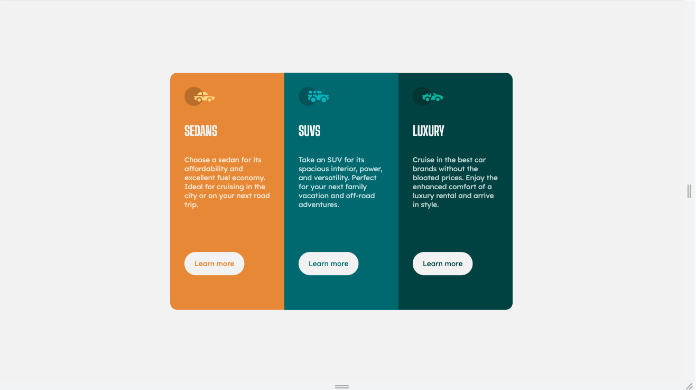
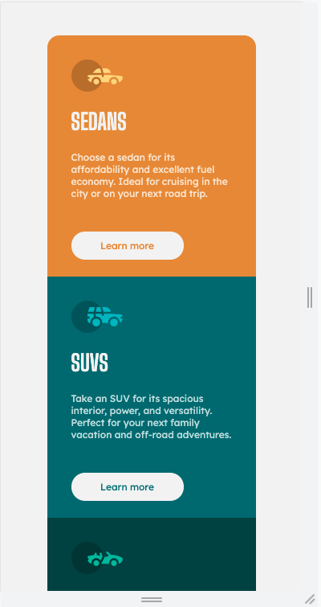

# Frontend Mentor - 3-column preview card component solution

This is a solution to the [3-column preview card component challenge on Frontend Mentor](https://www.frontendmentor.io/challenges/3column-preview-card-component-pH92eAR2-). Frontend Mentor challenges help you improve your coding skills by building realistic projects. 

## Table of contents

- [Overview](#overview)
  - [The challenge](#the-challenge)
  - [Screenshot](#screenshot)
  - [Links](#links)
- [My process](#my-process)
  - [Built with](#built-with)
- [Author](#author)

**Note: Delete this note and update the table of contents based on what sections you keep.**

## Overview

### The challenge

Users should be able to:

- View the optimal layout depending on their device's screen size

### Screenshot
Desktop Version

Mobile Version  

### Links

- Live Site URL: [3 Column Preview](https://your-live-site-url.com)

## My process

### Built with

- HTML5 markup
- CSS custom properties
- Flexbox
- Mobile-first workflow

## Author

- Github - [@yourusername](https://github.com/teetechdev)
- Frontend Mentor - [teetechdev](https://www.frontendmentor.io/profile/teetechdev)
